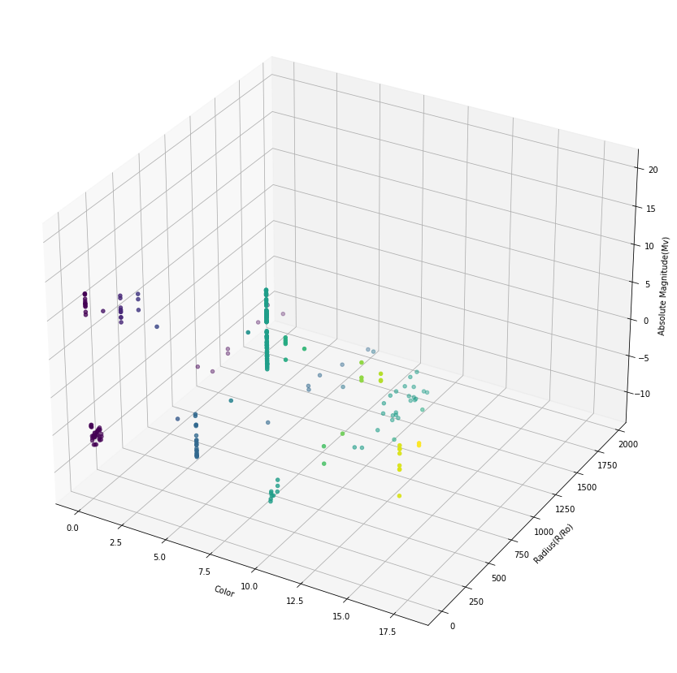
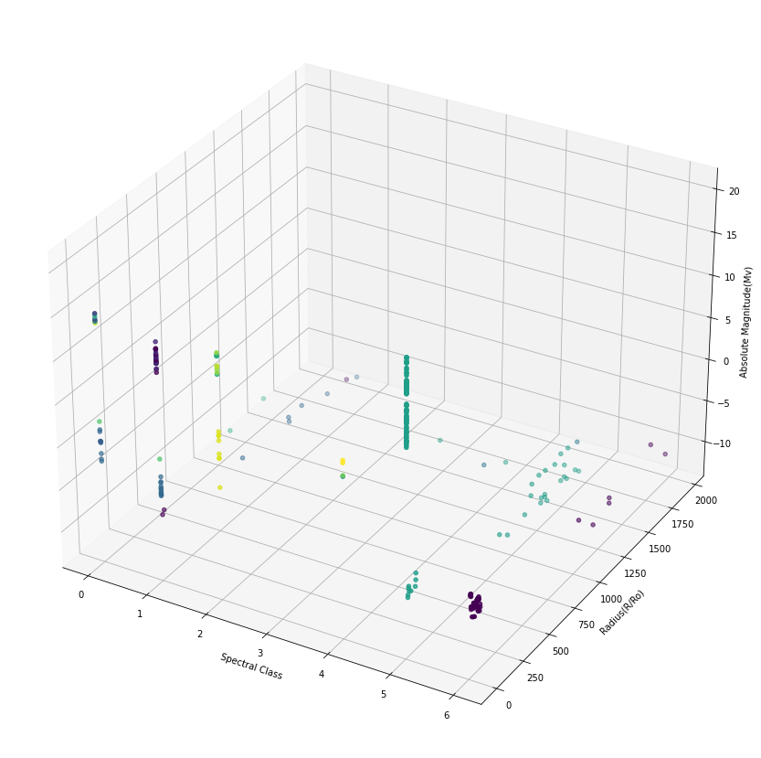
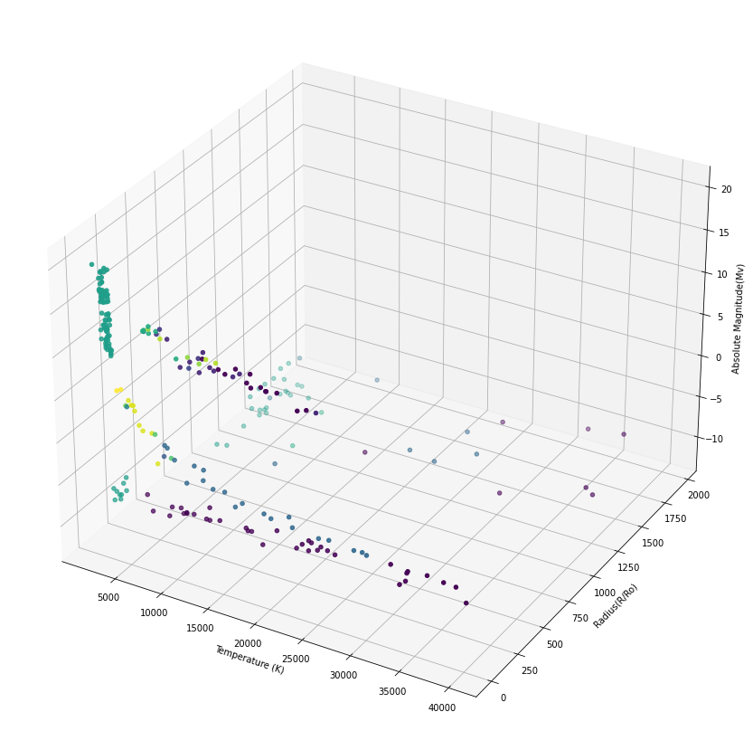
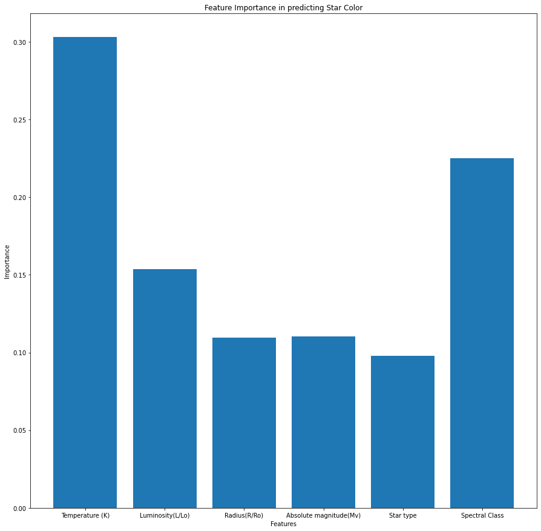

# Hello ACM


This will be a notebook where I explore a data set with multiple algorithms and see what observations can be made

## Neighboring Stars

### K-Nearest Neighbors

This algorithm takes data points and attempts to classify them against an x and y based on its nearest neighbors. Changing K changes the amount of neighbors tested. The neighbor with the highest count is decided to be the group that the data point belongs to. 


```python
# Import Libraries
import pandas as pd
import numpy as np
from sklearn.preprocessing import LabelEncoder
from sklearn.model_selection import train_test_split
from sklearn.neighbors import KNeighborsClassifier
```

### Loading Data


```python
# Load the data set
data = pd.read_csv('data/6class.csv')
```

### We convert string columns so that data types are uniform


```python
# Label encode the star color and spectral class
le = LabelEncoder()
data['Star color'] = le.fit_transform(data['Star color'])
data['Spectral Class'] = le.fit_transform(data['Spectral Class'])
```

### Deciding the Y. In this case we will be isolating color


```python
X = data.drop(['Star color'], axis=1)
y = data['Star color']  
X_train, X_test, y_train, y_test = train_test_split(X, y, test_size=0.2, random_state=42)
```


Now let us take a look at what these neighborhoods look like

### Graphing

#### Graphing against color


```python
from mpl_toolkits.mplot3d import Axes3D
import matplotlib.pyplot as plt

fig = plt.figure()
ax = fig.add_subplot(111, projection='3d')

ax.scatter(data['Star color'], data['Radius(R/Ro)'], data['Absolute magnitude(Mv)'], c=data['Star color'], marker='o')

ax.set_xlabel('Color')
ax.set_ylabel('Radius(R/Ro)')
ax.set_zlabel('Absolute Magnitude(Mv)')

plt.show()
```





#### Graphing against spectral class


```python
fig = plt.figure()
ax = fig.add_subplot(111, projection='3d')

ax.scatter(data['Spectral Class'], data['Radius(R/Ro)'], data['Absolute magnitude(Mv)'], c=data['Star color'], marker='o')

ax.set_xlabel('Spectral Class')
ax.set_ylabel('Radius(R/Ro)')
ax.set_zlabel('Absolute Magnitude(Mv)')

plt.show()

```





#### Graphing against temperture


```python
fig = plt.figure()
ax = fig.add_subplot(111, projection='3d')

ax.scatter(data['Temperature (K)'], data['Radius(R/Ro)'], data['Absolute magnitude(Mv)'], c=data['Star color'], marker='o')

ax.set_xlabel('Temperature (K)')
ax.set_ylabel('Radius(R/Ro)')
ax.set_zlabel('Absolute Magnitude(Mv)')

plt.show()
```





### Now train, test, and evaluate


```python
# Train the model
knn = KNeighborsClassifier(n_neighbors=2)
knn.fit(X_train, y_train)

# Test the model
y_pred = knn.predict(X_test)

# Evaluate the model
score = knn.score(X_test, y_test)
print("Accuracy:", score)
```

    Accuracy: 0.75


### Ok so..

What does this mean? Well if we look back, we see that I am testing against star color. In our case star colors are discrete values, meaning they behave as steps and/or levels  
rather than slopes or gradients. So as we can see, by using 2 neighbor, we have a fairly decent (for this case) accuracy of 75%.  


K-neighbors may not actually be the ideal algorithm for testing star color, so let us look at a different feature.


```python
X = data.drop(['Temperature (K)'], axis='columns')
y = data['Temperature (K)']  
X_train, X_test, y_train, y_test = train_test_split(X, y, test_size=0.2, random_state=42)
```


```python
# Train the model
knn = KNeighborsClassifier(n_neighbors=5)
knn.fit(X_train, y_train)

# Test the model
y_pred = knn.predict(X_test)

# Evaluate the model
score = knn.score(X_test, y_test)
print("Accuracy:", score)
```

    Accuracy: 0.0


### What?

0% accuracy. What exactly is going on here. What this is telling me is that the data is inaccessible without temperature, as if temperature is the most salient feature.  
I wonder if that is the case. Let us try a new feature.


```python
X = data.drop(['Absolute magnitude(Mv)'], axis='columns')
y = data['Absolute magnitude(Mv)']  
X_train, X_test, y_train, y_test = train_test_split(X, y, test_size=0.15, random_state=42)
```


```python
# Train the model
knn = KNeighborsClassifier(n_neighbors=5)
knn.fit(X_train, y_train)

# Test the model
y_pred = knn.predict(X_test)

# Evaluate the model
score = knn.score(X_test, y_test)
print("Accuracy:", score)
```


    ---------------------------------------------------------------------------

    ValueError                                Traceback (most recent call last)

    c:\Users\thewa\Desktop\projects\computational_neuroscience\AI_ML\kaggle\stars\star_shopping.ipynb Cell 24 in <cell line: 3>()
          <a href='vscode-notebook-cell:/c%3A/Users/thewa/Desktop/projects/computational_neuroscience/AI_ML/kaggle/stars/star_shopping.ipynb#X33sZmlsZQ%3D%3D?line=0'>1</a> # Train the model
          <a href='vscode-notebook-cell:/c%3A/Users/thewa/Desktop/projects/computational_neuroscience/AI_ML/kaggle/stars/star_shopping.ipynb#X33sZmlsZQ%3D%3D?line=1'>2</a> knn = KNeighborsClassifier(n_neighbors=5)
    ----> <a href='vscode-notebook-cell:/c%3A/Users/thewa/Desktop/projects/computational_neuroscience/AI_ML/kaggle/stars/star_shopping.ipynb#X33sZmlsZQ%3D%3D?line=2'>3</a> knn.fit(X_train, y_train)
          <a href='vscode-notebook-cell:/c%3A/Users/thewa/Desktop/projects/computational_neuroscience/AI_ML/kaggle/stars/star_shopping.ipynb#X33sZmlsZQ%3D%3D?line=4'>5</a> # Test the model
          <a href='vscode-notebook-cell:/c%3A/Users/thewa/Desktop/projects/computational_neuroscience/AI_ML/kaggle/stars/star_shopping.ipynb#X33sZmlsZQ%3D%3D?line=5'>6</a> y_pred = knn.predict(X_test)


    File c:\Users\thewa\AppData\Local\Programs\Python\Python310\lib\site-packages\sklearn\neighbors\_classification.py:207, in KNeighborsClassifier.fit(self, X, y)
        188 """Fit the k-nearest neighbors classifier from the training dataset.
        189 
        190 Parameters
       (...)
        203     The fitted k-nearest neighbors classifier.
        204 """
        205 self.weights = _check_weights(self.weights)
    --> 207 return self._fit(X, y)


    File c:\Users\thewa\AppData\Local\Programs\Python\Python310\lib\site-packages\sklearn\neighbors\_base.py:429, in NeighborsBase._fit(self, X, y)
        426 else:
        427     self.outputs_2d_ = True
    --> 429 check_classification_targets(y)
        430 self.classes_ = []
        431 self._y = np.empty(y.shape, dtype=int)


    File c:\Users\thewa\AppData\Local\Programs\Python\Python310\lib\site-packages\sklearn\utils\multiclass.py:200, in check_classification_targets(y)
        192 y_type = type_of_target(y, input_name="y")
        193 if y_type not in [
        194     "binary",
        195     "multiclass",
       (...)
        198     "multilabel-sequences",
        199 ]:
    --> 200     raise ValueError("Unknown label type: %r" % y_type)


    ValueError: Unknown label type: 'continuous'


### I see
The data is continuous. It appears that base knn is more suited for classification than regression. So what do we do? Well of course, KNR, KNNs older and cooler brother.


```python
from sklearn.neighbors import KNeighborsRegressor
# Train the model
knr = KNeighborsRegressor(n_neighbors=17)
knr.fit(X_train, y_train)

# Test the model
y_pred = knr.predict(X_test)

# Evaluate the model
score = knr.score(X_test, y_test)
print("Accuracy:", score)
```

    Accuracy: 0.8794034361057438


### Now
We have explored our neighboring stars and seen how the k-neighbors algorithm can help us traverse our data set. We have seen how k-neighbors can be used to find the closest neighbors in a data set, and how the number of neighbors we choose affects the accuracy of the model. Finally, we have seen how to use k-neighbors to make predictions about a new data point. Let's press on, and see what else we can learn.

## Who's the Hottest Star?

It can be daunting looking at a new data set for the first time.  
But thankfully rather than getting lost, the forest can help you find your way.   
Random forests in machine learning is a method with which one can discover salient features within the dataset, in other words, what feature has the greatest effect on another feature.  
It does so by spawning decision trees and traversing different features and recording their "outcomes" at the leaf nodes.   
It ranks the occurrences of each traversal with the outcome and determines from that the saliency of features.

https://builtin.com/data-science/random-forest-algorithm


```python

# importing libraries
import matplotlib.pyplot as plt
import pandas as pd
from sklearn.ensemble import RandomForestClassifier
from sklearn.preprocessing import LabelEncoder

# loading data
df = pd.read_csv('data/6class.csv')

```

### As previously mentioned

We have to take care of string data, because the machine learning algorithms are allergic. 


```python

# Encoding string columns
le = LabelEncoder()
df['Star color'] = le.fit_transform(df['Star color'])
df['Spectral Class'] = le.fit_transform(df['Spectral Class'])

```

### For this experiment

We will be judging a star by its color, to tell if it is Hot or Not. In other words, we will be running a Random Forest Classifier to determine the salience of each feature in determining a star's color.


```python

# defining the target and feature data
X = df.drop('Star color', axis=1)
y = df['Star color']

# training the model
model = RandomForestClassifier()
model.fit(X, y)

# checking the feature importance scores
feature_importance = model.feature_importances_

# printing the most important features
for i in range(len(X.columns)):
    print(X.columns[i], ':', feature_importance[i])

# visualize

plt.bar(X.columns, feature_importance)
plt.title('Feature Importance in predicting Star Color')
plt.xlabel('Features')
plt.ylabel('Importance')
plt.rcParams['figure.figsize'] = [15,15]

plt.show()


```

    Temperature (K) : 0.30311045924691504
    Luminosity(L/Lo) : 0.15382759275535335
    Radius(R/Ro) : 0.10960999576549249
    Absolute magnitude(Mv) : 0.11047568775637619
    Star type : 0.09795726399720774
    Spectral Class : 0.2250190004786552





## As we can see
It appears that a star's temperature is of decisive importance in deciding its color. What an intriguing way to view the data! Let us press forward...

## Star Shopping

Using what I have experimented with within the data and what I have discovered through my resources, I wonder if it is possible to predict the likelihood of a Goldilock Star  
within a given data-set.  


This resource provided me with reliable information on what to look for: https://iopscience.iop.org/article/10.3847/2041-8213/ab0651/meta


```python
import pandas as pd
from sklearn.model_selection import train_test_split
from sklearn.preprocessing import LabelEncoder
from sklearn.model_selection import GridSearchCV
from sklearn.linear_model import LogisticRegression
from sklearn.metrics import accuracy_score, precision_score, recall_score, f1_score
from sklearn.pipeline import Pipeline
from sklearn.ensemble import BaggingClassifier
from sklearn.decomposition import PCA
from sklearn.ensemble import RandomForestClassifier
import numpy as np
import warnings
warnings.filterwarnings('ignore')
```

### Loading the dataset


```python
df = pd.read_csv('data/6class.csv')
```

### Data Preprocessing


```python
le = LabelEncoder()
df['Star color'] = le.fit_transform(df['Star color'])
df['Spectral Class'] = le.fit_transform(df['Spectral Class'])
```

### Splitting Train Test


```python
#goldilock stars are K class
X = df.drop('Spectral Class', axis=1)
y = df['Spectral Class']
X_train, X_test, y_train, y_test = train_test_split(X, y, test_size=0.2, random_state=42, )
```

### Building the model (Logical Regression)


```python
clf = LogisticRegression(solver="liblinear", max_iter=100, verbose=True)
clf.fit(X_train, y_train)
```

    [LibLinear]


<style>#sk-container-id-7 {color: black;background-color: white;}#sk-container-id-7 pre{padding: 0;}#sk-container-id-7 div.sk-toggleable {background-color: white;}#sk-container-id-7 label.sk-toggleable__label {cursor: pointer;display: block;width: 100%;margin-bottom: 0;padding: 0.3em;box-sizing: border-box;text-align: center;}#sk-container-id-7 label.sk-toggleable__label-arrow:before {content: "▸";float: left;margin-right: 0.25em;color: #696969;}#sk-container-id-7 label.sk-toggleable__label-arrow:hover:before {color: black;}#sk-container-id-7 div.sk-estimator:hover label.sk-toggleable__label-arrow:before {color: black;}#sk-container-id-7 div.sk-toggleable__content {max-height: 0;max-width: 0;overflow: hidden;text-align: left;background-color: #f0f8ff;}#sk-container-id-7 div.sk-toggleable__content pre {margin: 0.2em;color: black;border-radius: 0.25em;background-color: #f0f8ff;}#sk-container-id-7 input.sk-toggleable__control:checked~div.sk-toggleable__content {max-height: 200px;max-width: 100%;overflow: auto;}#sk-container-id-7 input.sk-toggleable__control:checked~label.sk-toggleable__label-arrow:before {content: "▾";}#sk-container-id-7 div.sk-estimator input.sk-toggleable__control:checked~label.sk-toggleable__label {background-color: #d4ebff;}#sk-container-id-7 div.sk-label input.sk-toggleable__control:checked~label.sk-toggleable__label {background-color: #d4ebff;}#sk-container-id-7 input.sk-hidden--visually {border: 0;clip: rect(1px 1px 1px 1px);clip: rect(1px, 1px, 1px, 1px);height: 1px;margin: -1px;overflow: hidden;padding: 0;position: absolute;width: 1px;}#sk-container-id-7 div.sk-estimator {font-family: monospace;background-color: #f0f8ff;border: 1px dotted black;border-radius: 0.25em;box-sizing: border-box;margin-bottom: 0.5em;}#sk-container-id-7 div.sk-estimator:hover {background-color: #d4ebff;}#sk-container-id-7 div.sk-parallel-item::after {content: "";width: 100%;border-bottom: 1px solid gray;flex-grow: 1;}#sk-container-id-7 div.sk-label:hover label.sk-toggleable__label {background-color: #d4ebff;}#sk-container-id-7 div.sk-serial::before {content: "";position: absolute;border-left: 1px solid gray;box-sizing: border-box;top: 0;bottom: 0;left: 50%;z-index: 0;}#sk-container-id-7 div.sk-serial {display: flex;flex-direction: column;align-items: center;background-color: white;padding-right: 0.2em;padding-left: 0.2em;position: relative;}#sk-container-id-7 div.sk-item {position: relative;z-index: 1;}#sk-container-id-7 div.sk-parallel {display: flex;align-items: stretch;justify-content: center;background-color: white;position: relative;}#sk-container-id-7 div.sk-item::before, #sk-container-id-7 div.sk-parallel-item::before {content: "";position: absolute;border-left: 1px solid gray;box-sizing: border-box;top: 0;bottom: 0;left: 50%;z-index: -1;}#sk-container-id-7 div.sk-parallel-item {display: flex;flex-direction: column;z-index: 1;position: relative;background-color: white;}#sk-container-id-7 div.sk-parallel-item:first-child::after {align-self: flex-end;width: 50%;}#sk-container-id-7 div.sk-parallel-item:last-child::after {align-self: flex-start;width: 50%;}#sk-container-id-7 div.sk-parallel-item:only-child::after {width: 0;}#sk-container-id-7 div.sk-dashed-wrapped {border: 1px dashed gray;margin: 0 0.4em 0.5em 0.4em;box-sizing: border-box;padding-bottom: 0.4em;background-color: white;}#sk-container-id-7 div.sk-label label {font-family: monospace;font-weight: bold;display: inline-block;line-height: 1.2em;}#sk-container-id-7 div.sk-label-container {text-align: center;}#sk-container-id-7 div.sk-container {/* jupyter's `normalize.less` sets `[hidden] { display: none; }` but bootstrap.min.css set `[hidden] { display: none !important; }` so we also need the `!important` here to be able to override the default hidden behavior on the sphinx rendered scikit-learn.org. See: https://github.com/scikit-learn/scikit-learn/issues/21755 */display: inline-block !important;position: relative;}#sk-container-id-7 div.sk-text-repr-fallback {display: none;}</style><div id="sk-container-id-7" class="sk-top-container"><div class="sk-text-repr-fallback"><pre>LogisticRegression(solver=&#x27;liblinear&#x27;, verbose=True)</pre><b>In a Jupyter environment, please rerun this cell to show the HTML representation or trust the notebook. <br />On GitHub, the HTML representation is unable to render, please try loading this page with nbviewer.org.</b></div><div class="sk-container" hidden><div class="sk-item"><div class="sk-estimator sk-toggleable"><input class="sk-toggleable__control sk-hidden--visually" id="sk-estimator-id-9" type="checkbox" checked><label for="sk-estimator-id-9" class="sk-toggleable__label sk-toggleable__label-arrow">LogisticRegression</label><div class="sk-toggleable__content"><pre>LogisticRegression(solver=&#x27;liblinear&#x27;, verbose=True)</pre></div></div></div></div></div>


### Predictions and Evaluations


```python
y_pred = clf.predict(X_test)

accuracy = accuracy_score(y_test, y_pred)
precision = precision_score(y_test, y_pred, average='weighted')
recall = recall_score(y_test, y_pred, average='weighted')
f1 = f1_score(y_test, y_pred, average='weighted', labels=np.unique(y_pred))

# Printing the evaluation metrics
print("Accuracy:", accuracy)
print("Precision:", precision)
print("Recall:", recall)
print("F1-score:", f1)
```

    Accuracy: 0.875
    Precision: 0.797183794466403
    Recall: 0.875
    F1-score: 0.9279673814557535


#### Boosting Accuracy using Grid Search Optimization and Random Forest feature identifiers

---

I like these results but it could be better. Finding a new habitable star depends on it, so we can not be sloppy.  
Idea adapted from: https://towardsdatascience.com/logistic-regression-model-tuning-with-scikit-learn-part-1-425142e01af5


```python
# Create first pipeline for base without reducing features.

pipe = Pipeline([('classifier' , RandomForestClassifier())])
# pipe = Pipeline([('classifier', RandomForestClassifier())])

# Create param grid.

param_grid = [
    {'classifier' : [LogisticRegression()],
     'classifier__penalty' : ['l2', 'l1'],
    'classifier__C' : np.logspace(-4, 4, 20)},
    {'classifier' : [RandomForestClassifier()],
    'classifier__n_estimators' : list(range(10,101,10)),
    'classifier__max_features' : list(range(6,32,5))}
]
# Create grid search object

clf = GridSearchCV(pipe, param_grid = param_grid, cv = 5, verbose=True, n_jobs=-1)

# Fit on data

best_clf = clf.fit(X_train, y_train)

preds = best_clf.predict(X_test)

# Create second pipeline for feature reduction

pipe_2 = Pipeline([('reducer', PCA()),
               ('classifier', RandomForestClassifier())])

# Create a param grid for the second pipeline

param_grid_2 = [
    {'classifier' : [LogisticRegression()],
     'classifier__penalty' : ['l2', 'l1'],
    'classifier__C' : np.logspace(-4, 4, 20)},
    {'reducer__n_components' : [6,9,12],
    'classifier' : [RandomForestClassifier()],
    'classifier__n_estimators' : list(range(10,101,10)),
    'classifier__max_features' : list(range(6,32,5))}
]

# Create grid search object

clf_2 = GridSearchCV(pipe_2, param_grid = param_grid_2, cv = 5, verbose=True, n_jobs=-1)

# Fit on data

best_clf_2 = clf_2.fit(X, y)

# Predict on test data

preds_2 = best_clf_2.predict(X_test)

# Create third pipeline for ensemble

pipe_3 = Pipeline([('ensemble', BaggingClassifier())])

# Create param grid for the third pipeline

param_grid_3 = {'ensemble__base_estimator': [LogisticRegression(), RandomForestClassifier()],
              'ensemble__n_estimators' : [10,20,100],
              'ensemble__max_samples': [0.5, 0.7, 1.0]}

# Create grid search object

clf_3 = GridSearchCV(pipe_3, param_grid = param_grid_3, cv = 5, verbose=True, n_jobs=-1)

# Fit on data

best_clf_3 = clf_3.fit(X, y)

# Predict on test data

preds_3 = best_clf_3.predict(X_test)

print('Model 1 Results:', accuracy_score(y_test,preds))
print('Model 2 Results:', accuracy_score(y_test,preds_2))
print('Model 3 Results:', accuracy_score(y_test,preds_3))
```

    Fitting 5 folds for each of 100 candidates, totalling 500 fits
    Fitting 5 folds for each of 220 candidates, totalling 1100 fits
    Fitting 5 folds for each of 18 candidates, totalling 90 fits
    Model 1 Results: 0.8958333333333334
    Model 2 Results: 1.0
    Model 3 Results: 0.9791666666666666


### Evaluation of Results

WOW. It appears that with Model 2 (PCA feature reduction) we have reached an accuracy of 100%! And even across the board, the use of an algorithmic pipeline has increased the accuracy in all 3 cases.

Now that we have found the optimal model, we can go ahead and implement it to search for new star systems that are likely to be habitable.

### Future Research:

We might investigate employing more advanced Deep Learning Architecture in the future to solve this issue. To further enhance the results, we might add include ensemble models like stacking and boosting. Additionally, to speed up and improve the efficiency of an algorithmic pipeline, we may consider Distributed Computing strategies like employing Spark. In the end, everything is based on the project's requirements and scope.


## Resources  
 
https://iopscience.iop.org/article/10.3847/2041-8213/ab0651/meta  
https://towardsdatascience.com/logistic-regression-model-tuning-with-scikit-learn-part-1-425142e01af5
